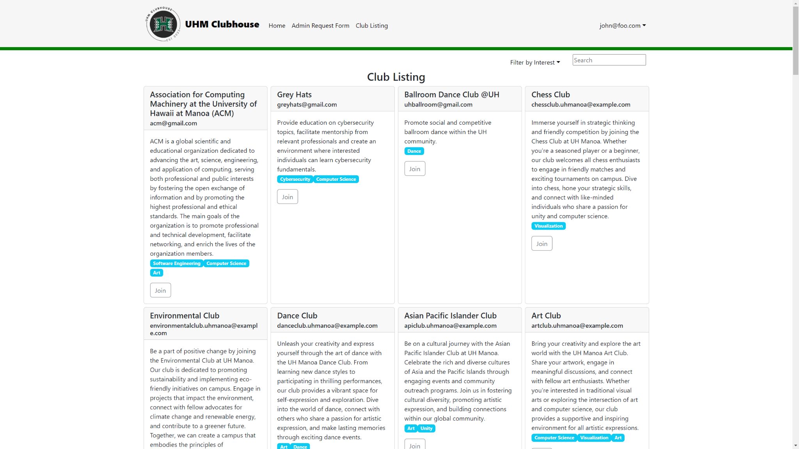

Finding and learning about available student clubs at UH Manoa is a difficult task that the UHM Clubhouse intends to solve. The UHM Clubhouse is an application for students to browse an organized directory of all current student clubs with brief descriptions, meeting information, and contact information.

<pre>

</pre>

Source: <a href="https://uhm-clubhouse.github.io/"><i class="large github icon "></i>https://uhm-clubhouse.github.io/</a>
